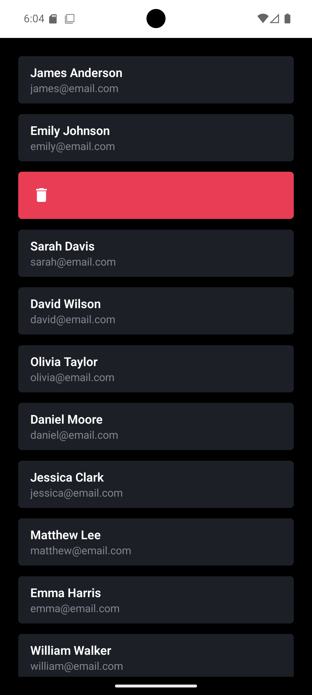

# ReanimatedSwipeable

Um projeto React Native desenvolvido com Expo que demonstra o uso de **React Native Reanimated** e **React Native Gesture Handler** para criar uma lista de contatos com funcionalidades de swipe para ações rápidas.

## 🚀 Funcionalidades

- **Lista de Contatos**: Exibição de uma lista elegante de contatos com nome e email
- **Swipe Gestures Intuitivos**: Deslize para revelar ações contextuais
- **Ações Contextuais**:
  - **Swipe para esquerda**: Revela ações de **Editar** (verde) e **Fechar** (azul)
  - **Swipe para direita**: Revela ação de **Deletar** (vermelho) com ícone de lixeira
- **Animações Fluidas**: Implementado com React Native Reanimated para performance otimizada
- **Interface Moderna**: Design dark com cards arredondados e transições suaves
- **Gestão Inteligente**: Apenas um swipe ativo por vez, fechamento automático ao abrir outro

## 🛠️ Tecnologias Utilizadas

- **React Native** (0.79.5)
- **Expo SDK** (~53.0.17)
- **TypeScript** (~5.8.3)
- **React Native Gesture Handler** (~2.24.0)
- **React Native Reanimated** (~3.17.4)
- **Expo Vector Icons** (^14.1.0)

## 📱 Screenshots

| Ações de Swipe para Esquerda | Ação de Deletar (Swipe Direita) |
|:---:|:---:|
|  |  |

### Funcionalidades em Ação

- **Primeira imagem**: Demonstra as ações disponíveis ao deslizar para a **esquerda** - botões de **Editar** (verde) e **Fechar** (azul)
- **Segunda imagem**: Mostra a ação de **Deletar** (vermelho) disponível ao deslizar para a **direita** com ícone de lixeira

## 🔧 Instalação e Configuração

### Pré-requisitos

- Node.js (versão 16 ou superior)
- npm ou yarn
- Expo CLI
- Expo Go app (para teste em dispositivo físico) ou emulador

### Passos para instalação

1. **Clone o repositório**

   ```bash
   git clone https://github.com/trydavidqix/ReanimatedSwipeable.git
   cd ReanimatedSwipeable
   ```

2. **Instale as dependências**

   ```bash
   npm install
   ```

3. **Inicie o projeto**

   ```bash
   npm start
   ```

   ou

   ```bash
   npx expo start
   ```

4. **Execute em diferentes plataformas**

   ```bash
   # Android
   npm run android
   
   # iOS
   npm run ios
   
   # Web
   npm run web
   ```

## 📁 Estrutura do Projeto

```text
ReanimatedSwipeable/
├── assets/                 # Ícones e recursos do app
│   ├── adaptive-icon.png
│   ├── favicon.png
│   ├── icon.png
│   └── splash-icon.png
├── src/
│   ├── app/
│   │   └── home/           # Tela principal
│   │       ├── index.tsx
│   │       └── styles.ts
│   ├── components/
│   │   ├── card/           # Componente de cartão de contato
│   │   │   ├── index.tsx
│   │   │   └── styles.ts
│   │   └── option/         # Componente de opção de ação
│   │       ├── index.tsx
│   │       └── styles.ts
│   └── utils/
│       └── contacts.ts     # Dados mock dos contatos
├── App.tsx                 # Componente raiz
├── app.json               # Configuração do Expo
├── package.json
└── tsconfig.json
```

## 💡 Como Usar

1. **Visualizar Contatos**: Role a lista para navegar pelos contatos disponíveis
2. **Ações por Swipe**:
   - **Deslize para a esquerda**: Revela botões de **Editar** (verde) e **Fechar** (azul)
   - **Deslize para a direita**: Revela botão de **Deletar** (vermelho) com ícone de lixeira
3. **Gerenciamento Automático**:
   - Apenas um card pode estar aberto por vez
   - Ao abrir um novo card, o anterior se fecha automaticamente
   - Toque fora da área para fechar as ações

## 🎨 Componentes Principais

### `Home`

Componente principal que gerencia a lista de contatos e as funcionalidades de swipe.

### `Card`

Componente que exibe as informações de cada contato (nome e email).

### `Option`

Componente reutilizável para as opções de ação que aparecem no swipe, utilizando ícones do Material Icons.

## ⚙️ Configuração de Gestos

O projeto utiliza o `ReanimatedSwipeable` do React Native Gesture Handler com as seguintes configurações:

- **overshootFriction**: 8 (controla a resistência do swipe)
- **Ações à direita**: Editar e visualizar
- **Ações à esquerda**: Deletar
- **Fechamento automático**: Quando um novo swipe é iniciado

## 🤝 Contribuição

Contribuições são sempre bem-vindas! Sinta-se à vontade para:

1. Fazer fork do projeto
2. Criar uma branch para sua feature (`git checkout -b feature/AmazingFeature`)
3. Commit suas mudanças (`git commit -m 'Add some AmazingFeature'`)
4. Push para a branch (`git push origin feature/AmazingFeature`)
5. Abrir um Pull Request

## 📝 Licença

Este projeto está sob a licença MIT. Veja o arquivo `LICENSE` para mais detalhes.

## Author

| [<br><sub>David Macêdo</sub>](https://github.com/trydavidqix) |
| :---------------------------------------------------------------------------------------------------------------------------------------: |
| [LinkedIn](https://www.linkedin.com/in/trydavidqix/) |
